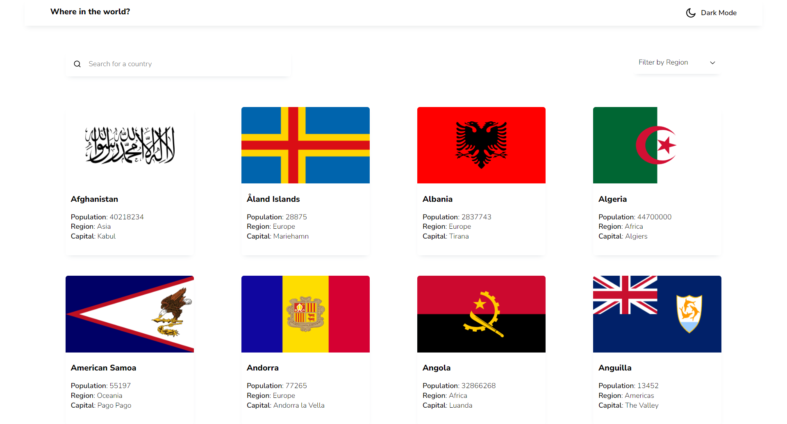

# Frontend Mentor - REST Countries API with color theme switcher

## Welcome! 👋

## Table of contents

- [Overview](#overview)
  - [The challenge](#the-challenge)
  - [Screenshot](#screenshot)
  - [Links](#links)
- [My process](#my-process)
  - [Built with](#built-with)
- [Author](#author)

**Note: Delete this note and update the table of contents based on what sections you keep.**

## Overview

### The challenge

Users should be able to:

- See all countries from the API on the homepage
- Search for a country using an `input` field
- Filter countries by region
- Click on a country to see more detailed information on a separate page
- Toggle the color scheme between light and dark mode _(optional)_

### Screenshot

### Links

- Solution URL: [GitHub](https://github.com/ArtemDerenok/rest-countries-api)
- Live Site URL: [Deploy](https://zippy-creponne-2d84e6.netlify.app/)

## My process

### Built with

- Semantic HTML5 markup
- SCSS
- Flexbox
- Mobile-first workflow
- [TypeScript](https://www.typescriptlang.org/) - TypeScript is JavaScript with syntax for types
- [React](https://reactjs.org/) - JS library
- [Redux Toolkit](https://redux-toolkit.js.org/) - State management tool
- [React router dom](https://reactrouter.com/en/main) - The react-router-dom package contains bindings for using React Router in web applications
- [EsLint](https://eslint.org/) - ESLint is an open source project that helps you find and fix problems with your JavaScript code

## Author

- Website - [Artem Derenok](https://vermillion-bombolone-14caa7.netlify.app/)
- Frontend Mentor - [@Artem Derenok](https://www.frontendmentor.io/profile/ArtemDerenok)
- LinkedIn - [@Artem Derenok](https://www.linkedin.com/in/artem-derenok-78ba6823b?lipi=urn%3Ali%3Apage%3Ad_flagship3_profile_view_base_contact_details%3BgDz3JUnCS5ywuJw8WKJQcw%3D%3D)
- Telegram - [@Artem Derenok](https://t.me/ARTD95)
